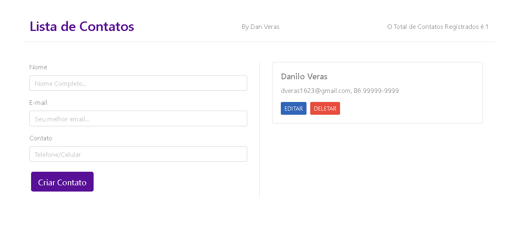

# lista_contatos
Lista de cadastro de contatos simples utilizando o vue.js como framework.

## Funcionalidades

- Cadastro de contatos
- Listagem dos contatos cadastrados
- Exclusão dos contatos
- Informa quantos contatos estão cadastrados

## Screenshots




## Pré-requisitos

Antes de começar, você vai precisar ter instalado em sua máquina as seguintes ferramentas:
 - [Git](https://git-scm.com).
 - [Vue](https://vuejs.org/). 

Além disto é bom ter um editor para trabalhar com o código como [VSCode](https://code.visualstudio.com/)

## Rodando localmente

Clone o projeto:

```bash
  git clone https://github.com/veras-dan/lista_contatos
```

Entre no diretório do projeto:

```bash
  cd lista_contatos
```

Instale as dependências:

```bash
  npm install
```

Inicie o servidor:

```bash
  npm run dev
```

## Contribuindo

Contribuições são sempre bem-vindas!

1. Faça um **fork** do projeto.
2. Crie uma nova branch com as suas alterações: `git checkout -b my-feature`
3. Salve as alterações e crie uma mensagem de commit contando o que você fez: `git commit -m "feature: My new feature"`
4. Envie as suas alterações: `git push origin my-feature`
> Caso tenha alguma dúvida confira este [guia de como contribuir no GitHub](./CONTRIBUTING.md)

## Autores

<a href="https://github.com/verasdan">
 
 <br />
 <sub><b>Dan Veras</b></sub></a> <a href="https://github.com/veras-dan" title="">🚀</a>
 <br />

---

  [](https://twitter.com/veras_dan) [](https://www.linkedin.com/in/verasdanilo/) 
  [](mailto:dveras1623@gmail.com)


## Suporte
Para suporte, mande um email para dveras1623@gmail.com.

